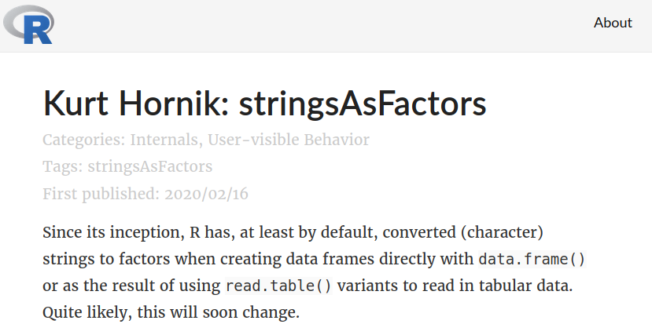
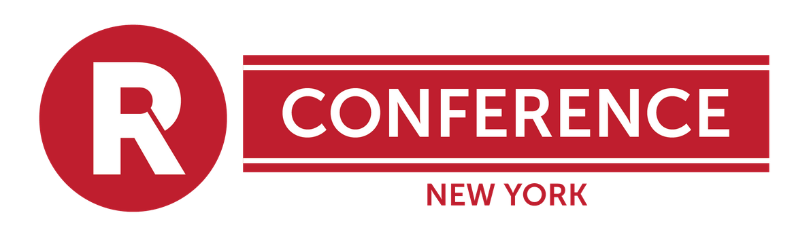
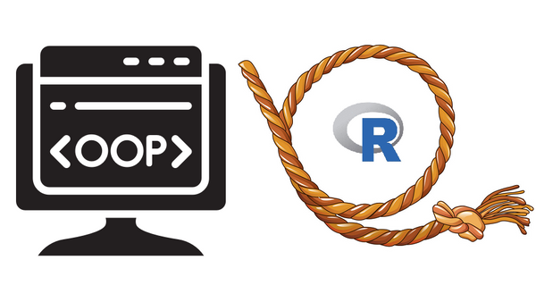

      
```{r setup, include=FALSE}
knitr::opts_chunk$set(echo = FALSE)
library(RUGtools)
```

## Chicago R User Group (CRUG) ...

- Happy New YeaR and New Decade! Welcome new and current useRs! 
- CRUG reached 3,800 members, one of largest groups in world!

    **Slack**
     
    [bit.ly/Slack-CRUG](http://bit.ly/Slack-CRUG)

    **Twitter**
    
    [ChicagoRusers](https://twitter.com/ChicagoRusers)

    **GitHub**
    
    @[Chicago-R-User-Group](https://github.com/Chicago-R-User-Group)

    **Meetup**
    
    [ChicagoRUG](https://www.meetup.com/ChicagoRUG/)
    
    **Website**
    
    [Chicago-r-user-group.github.io](https://chicago-r-user-group.github.io/)


## Who is here today?

<div style="text-align:center">


[ChicagoRUG](https://www.meetup.com/ChicagoRUG/)


[CRUG Meetup Attendance App](https://parfaitg.shinyapps.io/CRUG_Attendance_App/)
</div>

# Other General R news

# February 29th: 20 years since v1.0.0!


## R 4.0: sringsAsFactors 

<div style="text-align:center"></div>

<br/>- https://developer.r-project.org/Blog/public/2020/02/16/stringsasfactors/


# Upcoming 2020 Conferences

## June 5th-6th @UIC

<div style="text-align:center"></div>

<br/>

- Founded in the fall of 2008, by a small group of open source package authors, finance industry practitioners, and finance professors.
- Single-track presentation model, tutorials, roundtable, [keynotes](https://www.rinfinance.com/about/).
- [Call for Papers](https://uic.cvent.com/events/2020-r-finance-call-for-presentations/registration-add8ccef16bc42778b301c23ccab1a9e.aspx?fqp=true). Extended Dealine: February 29 (leap year).
- Early discounted registration will open in March.


## May 8-9th, NYC

<div style="text-align:center"></div>

<br/>

- [Registration Now Open!](https://rstats.ai/nyr/#tickets) 

- https://rstats.ai/nyr/#tickets

## July 8-10th, STL

<div style="text-align:center"></div>

<br/>

- [Early registration Now Open!](https://user2020.r-project.org/registration/instructions/) 

- https://user2020.r-project.org/registration/instructions/


# Anyone hiring R folks? 

# Tonight's Sponsor

## Special Thanks To 
<div style="text-align:center"></div>


# Tonight's Event

## Double Feature
<div style="text-align:center"></div>

- **Jared Lander: Many ways to Lasso**

- **Anthony Shook, Ph.D: Object-Oriented Programming in R**

